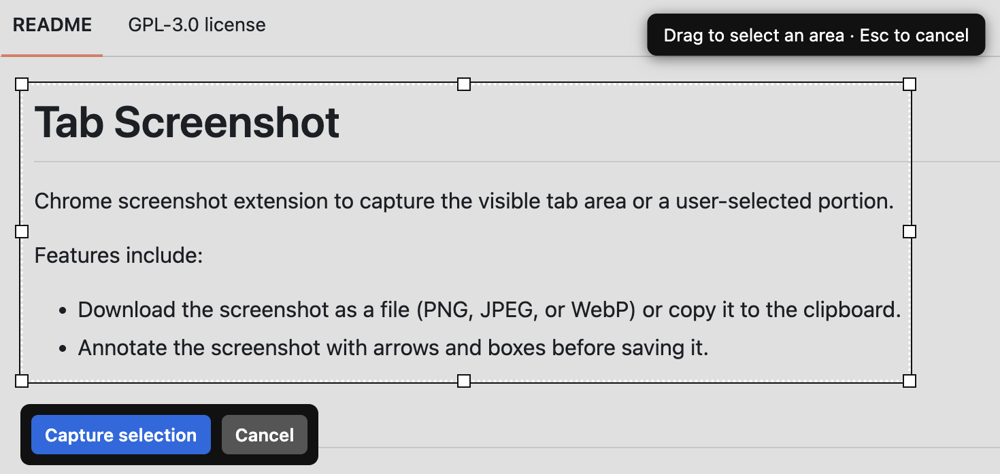
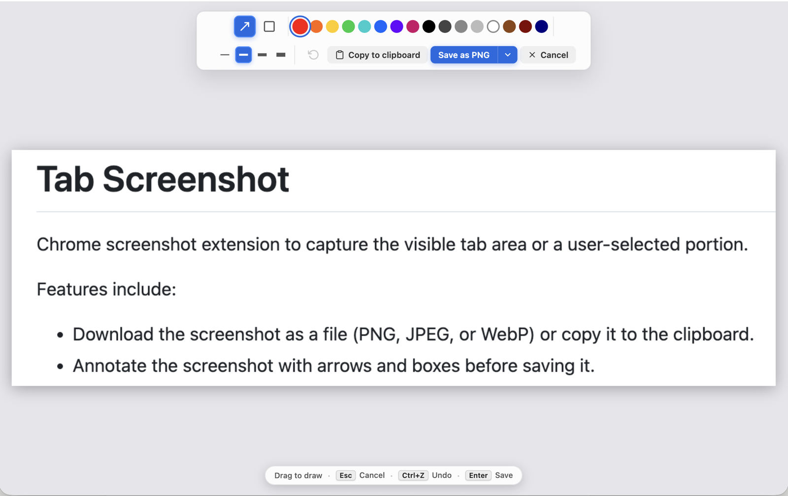

# Tab Screenshot

Capture, annotate, and save screenshots of your browser tabs — fast, private, and entirely local.


[](https://developer.chrome.com/docs/extensions)
[](https://github.com/russelldickenson/chrome-tab-screenshot/blob/main/LICENSE)

## What is Tab Screenshot?

A Chrome extension that captures either the visible portion of any browser tab or just the rectangular area you select.
After capturing, you can annotate your screenshot with arrows and boxes, then save it as a **PNG**, **JPEG**, or **WebP**
file, or copy it straight to your clipboard.

Every step runs locally in your browser. No data leaves your machine.

### Key features

| Feature | Description |
|-|-|
| 📸 **Two capture modes** | Grab the full visible viewport instantly, or drag to select a precise area |
| ✏️ **Rich annotations** | Draw arrows and boxes with 16 colors and adjustable stroke widths (2–8px) |
| 💾 **Flexible export** | Download as PNG/JPEG/WebP or copy directly to your system clipboard |
| 🔒 **Privacy-first** | Everything runs locally — no tracking, no uploads, no data collection |

> [!IMPORTANT]
> This app was entirely vibe-coded. I created this mainly to experiment with agentic AI. Use it at your
> own risk.

## Screenshots

<table>
  <tr>
    <td align="center">
      <br>
      <small><b>Capture options popup</b></small>
    </td>
    <td align="center">
      <br>
      <small><b>Drag-to-select overlay</b></small>
    </td>
    <td align="center">
      <br>
      <small><b>Annotation editor</b></small>
    </td>
    <td align="center">
      <br>
      <small><b>Example screenshot with annotations</b></small>
    </td>
  </tr>
</table>

## Quick start

### Install

This extension is not yet published to the Chrome Web Store, so you must install it locally.

1. Download or clone this repository to your computer.
2. Open `chrome://extensions` in Google Chrome.
3. Enable **Developer mode** in the top-right toggle.
4. Click **Load unpacked** and select the extension directory.
5. Click the **Tab Screenshot** icon in your browser toolbar.

### Usage

To capture a screenshot:

1. Click the **Tab Screenshot** icon in your browser toolbar.
2. Configure your export settings in the popup:
   - **Save to**: **File (download)** or **Clipboard**
   - **Image format**: **PNG**, **JPEG**, or **WebP** *(file only)*
   - **Annotate after capture**: toggle on to open the annotation editor after the screenshot is captured.
3. Choose a capture mode:
   - **Capture visible area** — captures the full viewport instantly
   - **Capture selected area** — drag the crosshair to select a region, then click **Capture selection**
4. If annotation is enabled, the **Annotation Editor** opens:
   - Select the **Arrow** or **Box** tool.
   - Pick a color and stroke width (2px–8px).
   - Press <kbd>Ctrl+Z</kbd> / <kbd>⌘Z</kbd> to undo.
5. Export your screenshot:
   - **Copy to clipboard** — copies the image to your system clipboard
   - **Save as [PNG / JPEG / WebP]** — downloads the image to your computer

## Privacy

Tab Screenshot is designed with privacy first. The extension:

- Does **not** collect, store, or transmit any personal data
- Does **not** track your browsing history
- Does **not** make any network requests
- Processes all images entirely locally in your browser

## How it works

```
popup.js → selector.js (content script)
  → background.js (service worker)
    → chrome.tabs.captureVisibleTab()
      → canvas (crop + encode)
        → annotation editor (optional)
          → file download | clipboard
```

All image processing uses the HTML5 Canvas API in your browser — no external services involved.

## Permissions

| Permission | Why it's needed |
|---|---|
| `activeTab` | Capture the current active tab when you click the extension |
| `tabs` | Open the annotation editor in a new tab after capture |
| `downloads` | Save screenshots to your local downloads folder |
| `storage` | Remember your preferred settings across sessions |
| `scripting` | Inject the selection overlay into the active page |
| `clipboardWrite` | Copy screenshots to your system clipboard |

## License

GPL v3 — see [LICENSE](LICENSE) for details.

## Author

**Russell Dickenson** — [GitHub](https://github.com/russelldickenson)
