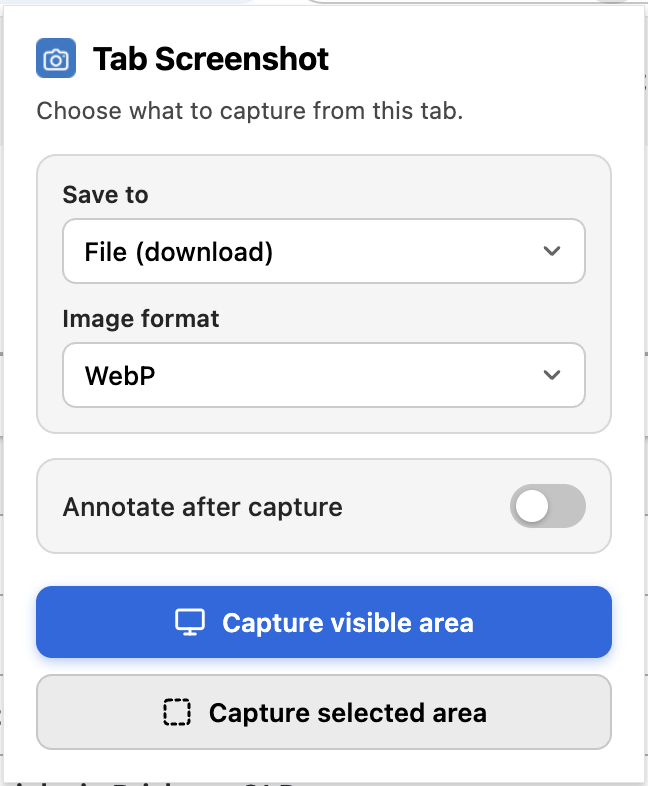
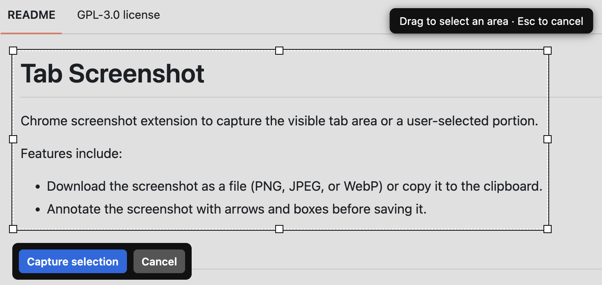
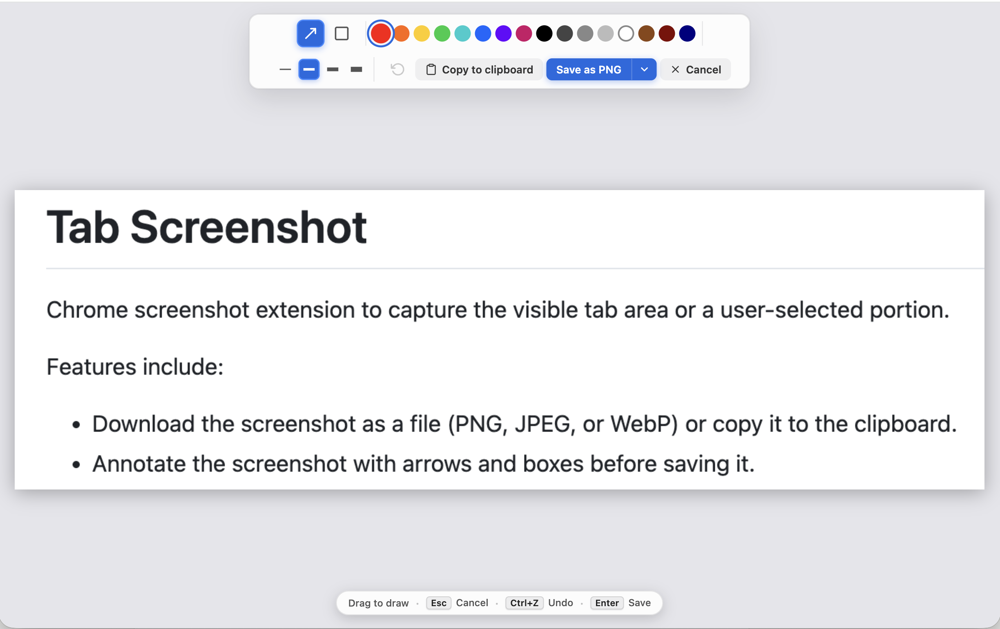
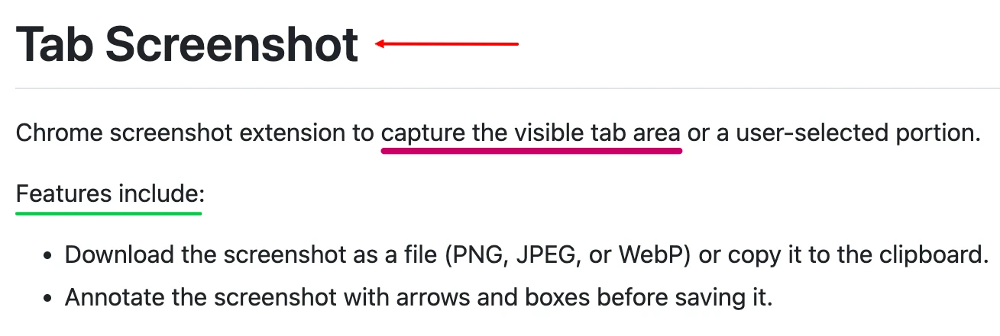

# Tab Screenshot

Chrome screenshot extension to capture the visible tab area or a user-selected portion.

Features include:

- Download the screenshot as a file (PNG, JPEG, or WebP) or copy it to the clipboard.
- Annotate the screenshot with arrows and boxes before saving it.

## Install

This extension is not yet published to the Chrome web store, so you must install it locally.

1. Open `chrome://extensions` in Google Chrome.
2. Enable **Developer mode** in the top-right toggle.
3. Click **Load unpacked** and select the extension directory.
4. Click the extension toolbar icon to capture screenshots.

## Capture a screenshot

The method you use to capture a screenshot depends on whether or not you want to annotate it
after you've captured it.

### Quick screenshot - No annotation

Use this workflow when you want to take a screenshot without annotating it.

1. Select the **Tab Screenshot** icon in your browser toolbar.
2. Ensure **Annotate after capture** is **not checked**.
3. Configure your export settings in the popup:
   - **Save to**: Choose **File (download)** or **Clipboard**.
   - **Image format**: Choose **PNG**, **JPEG**, or **WebP** _(when saving to a file)_.
4. Trigger your capture:
   - Click **Capture visible area** for an immediate viewport screenshot.
   - Click **Capture selected area**, drag the crosshair cursor to select the area to be
     captured, then select **Capture selection**.
5. Your screenshot is downloaded to your computer or copied to your clipboard instantly.

### Capture and annotate a screenshot

Use this workflow when you want to draw arrows or boxes on the screenshot before saving.

1. Select the **Tab Screenshot** icon in your browser toolbar.
2. Check **Annotate after capture** _(this hides upfront export options in the modal so
   you can choose export settings after editing)_.
3. Trigger your capture:
   - Click **Capture visible area** or **Capture selected area**.
3. The full-screen **Annotation Editor** will open:
   - Select the **Arrow** or **Box** tool from the toolbar.
   - Pick a color from the 16-color palette and select a line stroke width (2px–8px).
   - Press <kbd>Ctrl+Z</kbd> / <kbd>⌘Z</kbd> to undo any annotations.
4. Export your annotated screenshot. Choose one of the following options.
   - To copy the image directly to your system clipboard, select **Copy to clipboard** .
   - To download it to your computer, select **Save as [PNG / JPEG / WebP]**.
     _(Select the arrow next to the save button to choose the file format)_.
